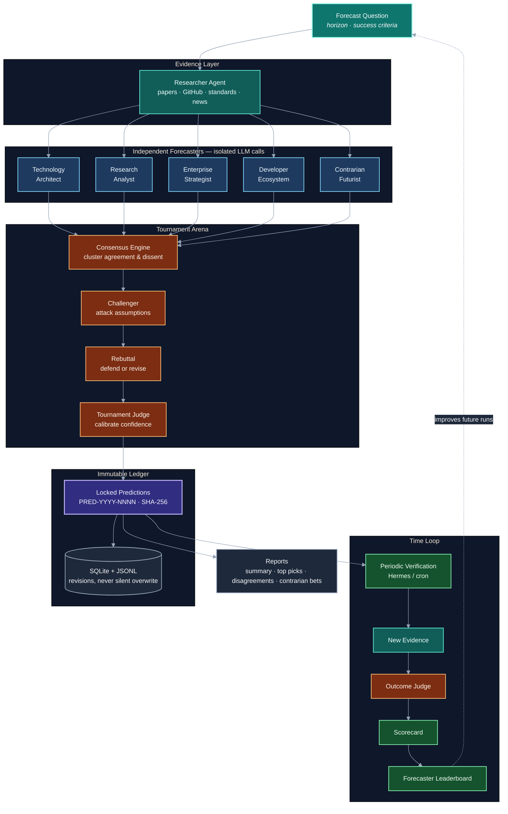

# ForesightColosseum

**Multi-agent technology forecasting tournament with challenge, judgment, and an immutable prediction ledger.**

Five independent AI forecasters compete on falsifiable tech bets. A challenger attacks every claim. Forecasters rebut. A judge locks calibrated confidence into a hashed ledger. Later, verification scores what actually came true — and builds a forecaster leaderboard over time.

> Forecast ≠ evidence · Confidence ≠ certainty · Consensus ≠ correctness · A changed world ≠ permission to rewrite old predictions

---

## Why it exists

Most “AI foresight” tools spit out opinions and move on. **ForesightColosseum** treats forecasting like a sport:

| Problem | What this does |
|---------|----------------|
| Single-model bias | Five independent personas, no shared draft |
| Hand-wavy claims | Requires falsifiable success criteria |
| Unchallenged confidence | Challenger → rebuttal → judge calibration |
| Silent rewrites | SHA-256 locked ledger + revisions only |
| No accountability | Monthly verification + scorecard + leaderboard |

Built for research labs, platform strategy teams, and Hermes-style scheduled ops.

---

## Architecture



### Confidence calibration

Transparent MVP blend (configurable in `config/tournament.yaml`):

```text
final = 0.50 × forecaster + 0.20 × challenger_adjusted + 0.30 × judge
```

Three probabilities are stored on every locked prediction: `forecaster_confidence`, `challenger_adjusted_confidence`, and `judge_confidence`.

---

## Agent roster

| Agent | Lens |
|-------|------|
| **Technology Architect** | Architecture, scalability, platform evolution |
| **Research Analyst** | Papers, benchmarks, breakthroughs |
| **Enterprise Strategist** | Adoption, security, governance, ROI |
| **Developer Ecosystem Analyst** | GitHub, OSS, SDKs, standards |
| **Contrarian Futurist** | Underestimated tech, second-order effects |

Forecasters never see each other’s drafts. Partial failures are logged; the tournament continues with whoever succeeds.

---

## Quick start

```bash
git clone https://github.com/AIFrontiersLab/ForesightColosseum.git
cd ForesightColosseum

python3 -m venv .venv
source .venv/bin/activate
pip install -r requirements.txt
cp .env.example .env
```

### Run a tournament

```bash
./scripts/technology-prediction-tournament.sh
./scripts/technology-prediction-tournament.sh --dry-run

python -m app.prediction_tournament run \
  --question "Which agent protocols will achieve meaningful adoption?"

python -m app.prediction_tournament verify
python -m app.prediction_tournament scorecard
python -m app.prediction_tournament show PRED-2026-0001
```

### LLM backends

| Mode | Setup |
|------|--------|
| **Ollama** (default) | Point `PREDICTION_LLM_BASE_URL` at your Ollama OpenAI-compatible endpoint |
| **OpenAI** | `PREDICTION_LLM_PROVIDER=openai` + `OPENAI_API_KEY` |

See `.env.example` and `config/tournament.yaml`.

### Hermes schedule (optional)

```bash
./scripts/install_hermes.sh
```

Recommended cadence:

```cron
# Tournament — Sundays at 3:00 AM
0 3 * * 0

# Verification — 6:00 AM on the 1st of each month
0 6 1 * *
```

---

## Outputs

Each run writes:

```text
outputs/prediction_tournament/YYYY-MM-DD/
  tournament-summary.md
  top-predictions.md
  consensus-map.md
  disagreements.md
  contrarian-bets.md
  predictions.json
  scorecard.md
```

Persistent store:

```text
data/prediction_tournament/
  predictions.jsonl
  evidence.jsonl
  scorecard.json
  tournament.db
  leaderboard.md
```

---

## Project layout

```text
app/
  prediction_tournament/   # orchestrator, agents, ledger, verify, scorecard
  config/                  # settings
config/tournament.yaml     # question, agents, weights, cost controls
scripts/                   # CLI wrappers + Hermes install
tests/                     # pytest suite
```

---

## Tests

```bash
.venv/bin/pytest -q
```

---

## Troubleshooting

| Symptom | Fix |
|---------|-----|
| No LLM available | Start Ollama or set OpenAI credentials |
| Vague predictions rejected | Make success criteria concrete and measurable |
| Partial tournament | Check logs; remaining agents still lock predictions |
| Thin research | System records the limitation; forecasters must not invent citations |

---

## Design principles

```text
FORECAST  ≠  EVIDENCE
CONFIDENCE ≠  CERTAINTY
CONSENSUS  ≠  CORRECTNESS
CHANGED WORLD ≠ PERMISSION TO REWRITE OLD PREDICTIONS
```

---

## License

MIT © [AI Frontiers Lab](https://github.com/AIFrontiersLab)
